# BigData_MachineLearning

## 第一章 绪论

机器学习：

机器学习是近20多年兴起的一门多领域交叉学科，涉及概率论、统计学、逼近论、凸 分析、算法复杂度理论等多门学科。机器学习理论主要是设计和分析一些让计算机可以 自动“学习”的算法。机器学习算法是一类从数据中自动分析获得规律，并利用规律对 未知数据进行预测的算法。因为学习算法中涉及了大量的统计学理论，机器学习与统计推断学联系尤为密切，也被称为统计学习理论。

人工智能/机器学习/深度学习

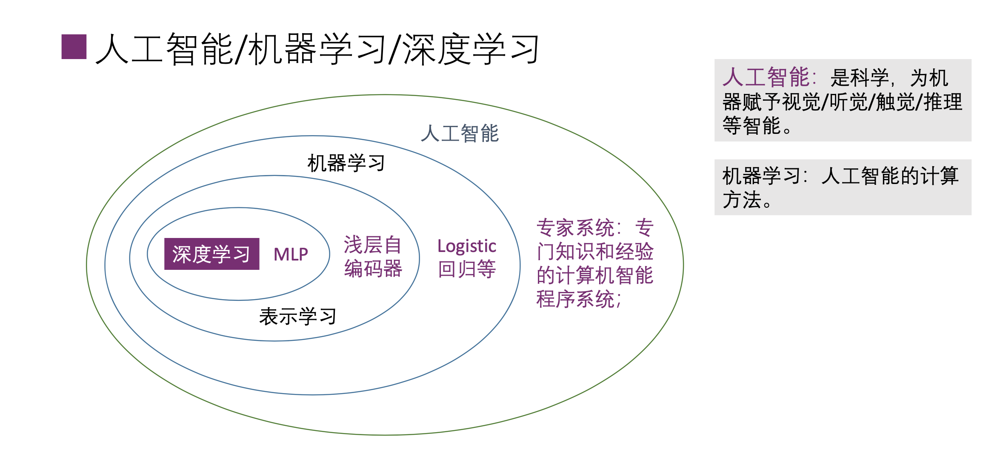

深度学习和人工智能其它方法

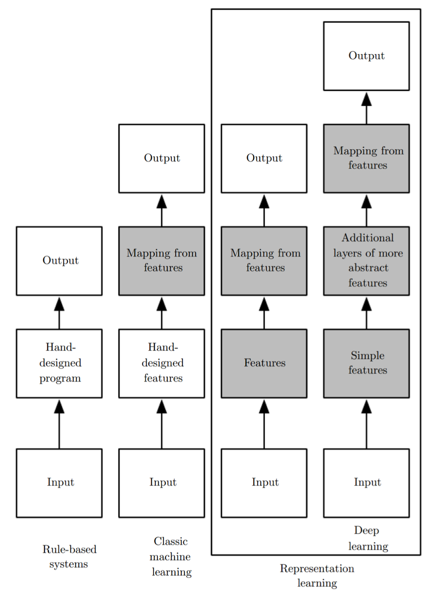

机器学习与数据挖掘

计算机视觉是机器学习最重要的应用

机器学习和统计学习

- Simon Blomberg:
  - From R’s fortunes package: To paraphrase provocatively, ‘machine learning is statistics minus any checking of models and assumptions
- Andrew Gelman:
  - In that case, maybe we should get rid of checking of models and assumptions more often. Then maybe we’d be able to solve some of the problems that the machine learning people can solve but we can’t

大数据机器学习的主要特征

- 与日俱增的数据量
- 实验数据量的增加
- 与日俱增的神经网络模型规模
- 与日俱增的精度、复杂度和对现实世界的冲击
- GPU (Graphic Processing Unit)
- TPU Tensor Processing Unit
- 深度学习框架
  - TensorFlow Pytorch Caffe CNTK Keras MXNet Theano Scikit-learning Spark MLlib

## 第二章 机器学习基本概念

基本术语

- Data set
  - 形状=圆形 剥皮=难 味道=酸甜
  - 形状=扁圆形 剥皮=易 味道=酸
  - 形状=长圆形 剥皮=难 味道=甜
- Instance/sample
- Attribute value/feature
- Attribute/feature space
- Feature vector

- $D={x_1,x_2,......x_m}$ m个示例的数据集
- 是$d$维样本空间X的一个特征向量
- training/learning
- training data
- training sample
- Label ((形状=长圆形 剥皮=难 味道=甜), 橙子)
- example

机器学习的任务

- Classification, discrete
- Regression, continuous
- Binary classification, 2-related
- Multi-class classification
- Clustering
- Multi-labeling annotation

监督学习

- 监督学习目的是学习一个由输入到输出的映射，称为模型
- 模型的集合就是假设空间(hypothesis space)
- 模型:
  - 概率模型:条件概率分布$P(Y|X)$
  - 非概率模型:决策函数$Y=f(X)$
- 联合概率分布:假设输入与输出的随机变量X和Y遵循联合概率 分布P(X,Y)

问题的形式化

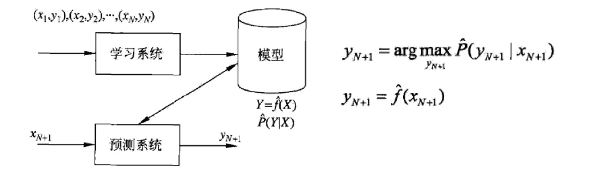

假设空间 hypothesis space

- 学习过程: 搜索所有假设空间，与训练集匹配
  - 形状=圆形 剥皮=难 味道=酸甜 橙
  - 形状=扁圆形 剥皮=易 味道=酸 橘
  - 形状=长圆形 剥皮=难 味道=甜 橙
- 假设形状，剥皮，味道 分别有3，2，3 种可能取值，加上取任意值*和空集， 假设空间规模$4x3x4+1=49$
- Version space: 与训练集一致的假设集合
  - 形状=*剥皮=难味道=* 橙
  - 形状=扁圆形 剥皮=易 味道=* 橘

学习三要素, 方法=模型+策略+算法

模型

- 当假设空间F为决策函数的集合: $F=\{f | Y=f(x) \}$
- F实质为参数向量决定的函数族: $F=\{f | Y=f_{\theta}(x), \theta\in R^{n} \}$
- 当假设空间F为条件概率的集合: $F=\{ P| P(X|Y)\}$
- F实质是参数向量决定的条件概率分布族: $F=\{ P|P_{\theta}(Y|X), \theta\in R^{n}\}$

策略

损失函数和风险函数

- 0-1 loss function, $L(Y, f(x))=\begin{cases} 
  1, & Y\neq f(X) \\
  2, & Y=f(X) \\
  \end{cases}$
- Quadratic loss function, $L(Y, f(X))=(Y-f(X))^{2}$
- Absolute loss function, $L(Y, f(X))=|Y-f(X)|$
- Logarithmic loss function/loglikelihood loss function, $L(Y, P(Y|X))=-\log P(Y|X)$

损失函数的期望，风险函数risk function，期望损失expected loss

- $R_{exp}(f)=E_{p}[L(Y, f(X))]=\int_{x\times y}L(y, f(x))P(x, y)dxdy$

经验风险empiracal risk, 经验损失empiracal loss

- $T={(x_1, y_1), (x_2, y_2), ..., (x_N, y_N)}$
- $R_{emp}(f)=\frac{1}{N}\sum_{i=1}^{N}L(y_i, f(x_i))$

因为风险函数很难求，一般使得经验风险最小化与结构风险最小化

- 经验风险最小化模型, $\min_{f\in F}\frac{1}{N}\sum_{i=1}^{N}L(y_{i}, f(x_{i}))$
- 当样本容量很小时，经验风险最小化学习的效果未必很好，会产生"过拟合over- fitting"
- 为防止过拟合提出的策略，结构风险最小化 structure risk minimization，等价 于正则化(regularization)，加入正则化项regularizer，或罚项 penalty term
  - $R_{emp}(f)=\frac{1}{N}\sum_{i=1}^{N}L(y_i, f(x_i)) + \lambda J(f)$

方法

求最优模型就是求解最优化问题:

- $\min_{f\in F}\frac{1}{N}\sum_{i=1}^{N}L(y_i, f(x_i)) + \lambda J(f)$
- 难点
  - 全剧最优
  - 高校

奥卡姆剃刀原理 Occam’s razor

“如无必要，勿增实体”

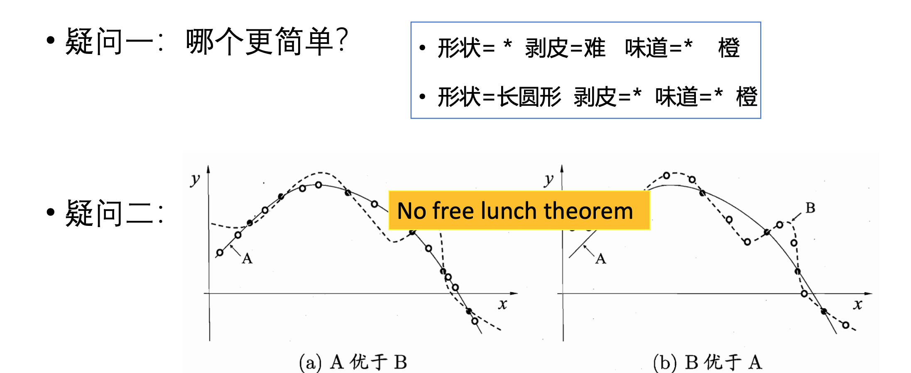

No free lunch theorem

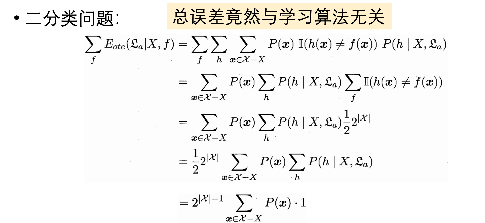

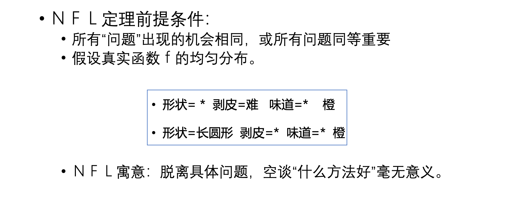

训练误差和测试误差

训练误差, 训练数据集的平均损失: $R_{emp}(\hat{f})=\frac{1}{N}\sum_{i=1}^{N}L(y_{i}, \hat{f(x_{i})})$

测试误差, 测试训练集的平均损失: $e_{test}=\frac{1}{N}\sum_{i=1}^{N}L(y_{i}, \hat{f(x_{i})})$

损失函数是0-1损失时: $e_{test}=\frac{1}{N'}\sum_{i=1}^{N'}L(y_i\neq \hat{f(x_i)})$

测试数据集的准确率: $r_{test}=\frac{1}{N'}\sum_{i=1}^{N'}L(y_i=\hat{f(x_i)})$

$e_{test} + r_{test} = 1$

过拟合

- 过拟合与模型选择-多项式曲线拟合的例子
- 假设给定训练数据集

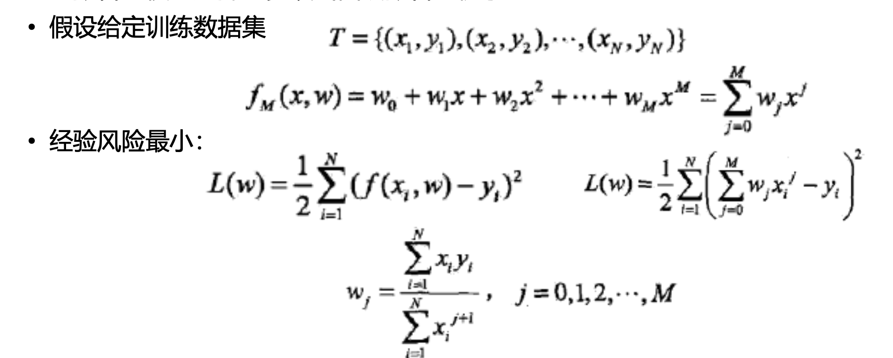

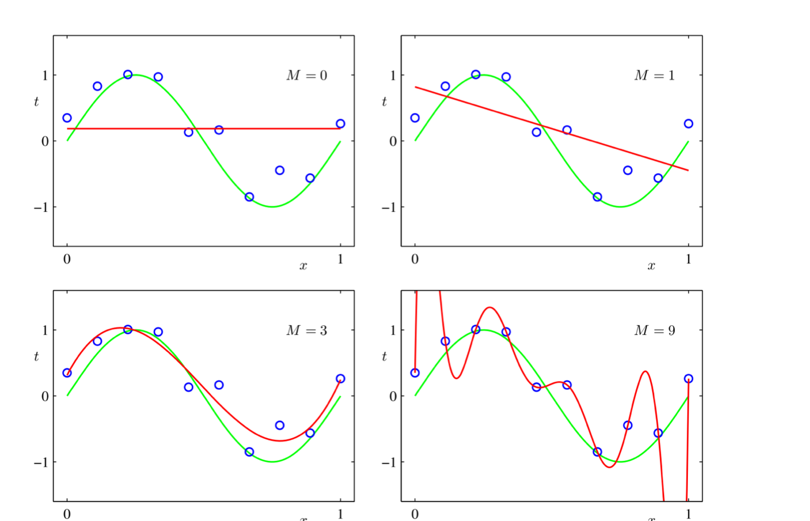

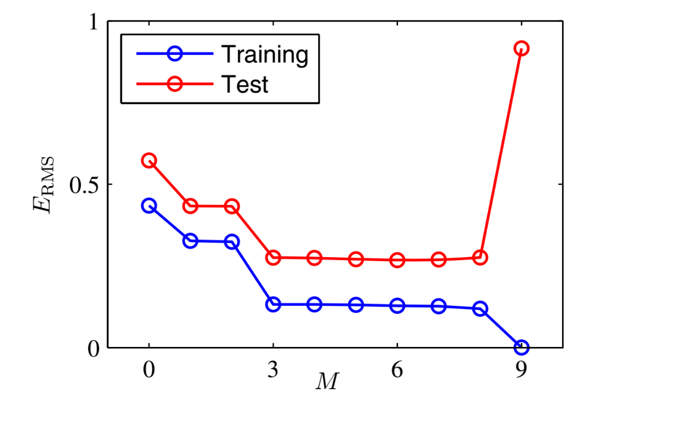

$M=9$为过拟合

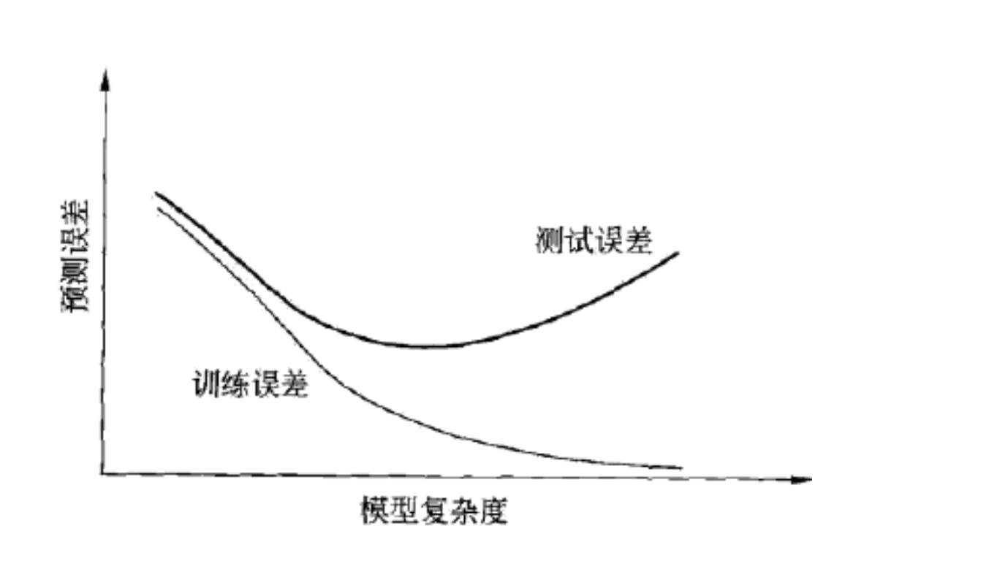

解决方法：

- 增大训练样本集
  - 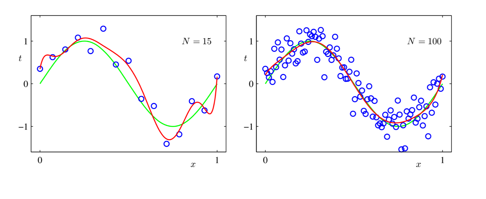
- 正则化
  - 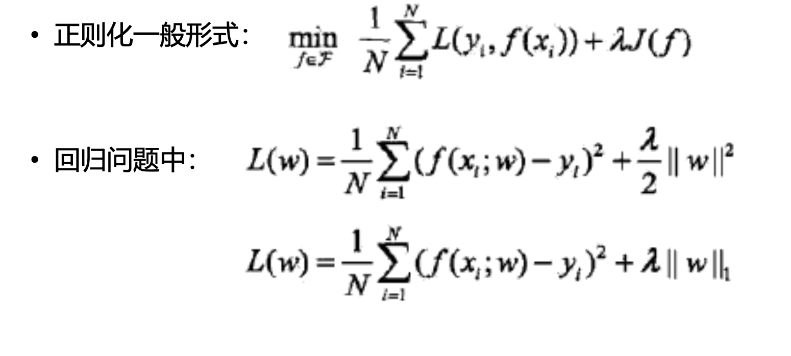
  - 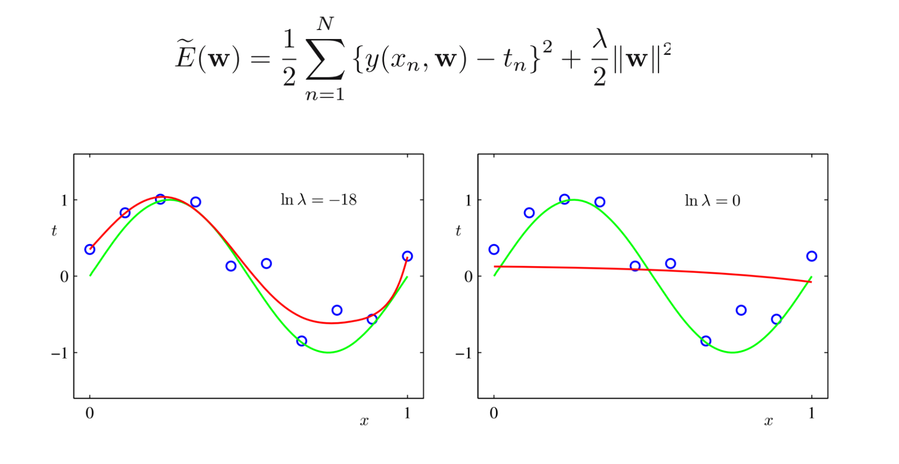
  - $\lambda$抑制模型复杂化

泛化能力 generalization ability

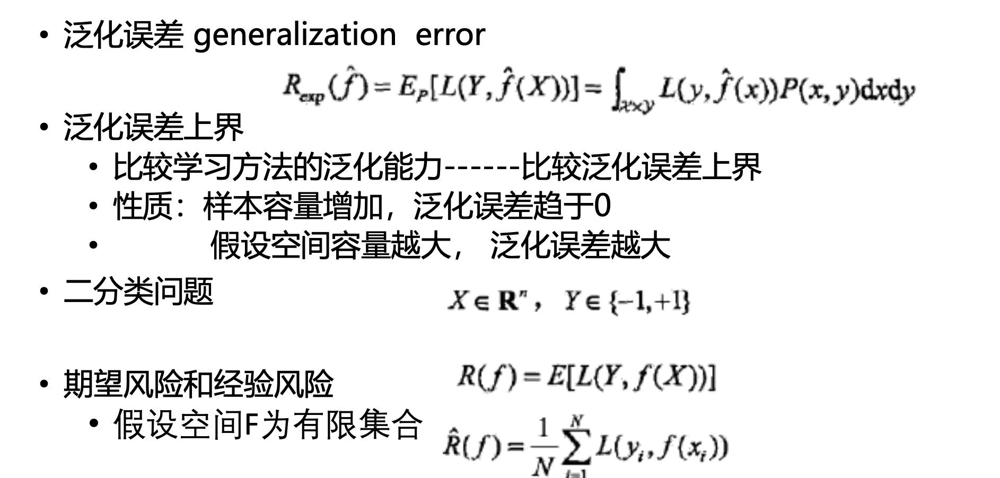

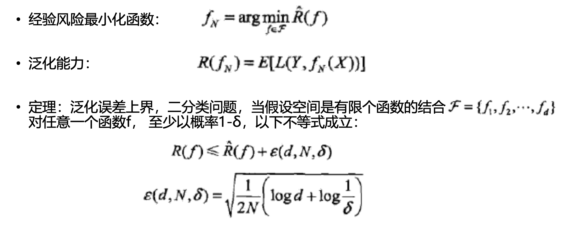

$d$为假设空间

生成模型与判别模型

- 监督学习的目的就是学习一个模型:
- 决策函数: $Y=f(X)$
- 条件概率分布: $P(Y|X)$
  - 生成方法Generative approach 对应生成模型: generative model，
    - 朴素贝叶斯法和隐马尔科夫模型
  - 判别方法discriminative approach 对应判别模型: discriminative model
    - K近邻，感知机，决策树，logistic 回归等

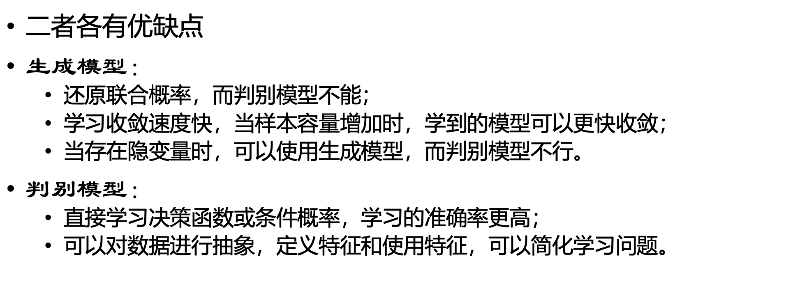

## 第三章 模型评估方法

模型评估方法

- 泛化误差评估:
  - 训练集 training set: 用于训练模型
  - 验证集 validation set: 用于模型选择
  - 测试集 test set: 用于模型泛化误差的近似
- 训练集和测试集的产生
  - 留出法
  - 交叉验证法
  - 自助法

留出法 Hold-out

训练集S, 测试集T, D为数据集

$D=S\cup T$

$S\cap T=\oslash$

- 注意点:
  - 训练/测试集的划分尽可能保持数据分布的一致性，避免引入额外偏差
  - 存在多种划分方式对初始数据集进行分割，采用若干次随机划分，重复实验
- 存在问题:
  - S大，T小; S小，T大，都会带来负面影响

交叉验证法 cross validation

- $D \rightarrow k$个大小相等的互斥子集
- $D=D_{1}\cup D_{2}\cup ...\cup D_{k}$, $D_{i}\cap D_{j}=\oslash (i\neq j)$
- $K-1$个子集并集为训练集，$1$个测试集
- 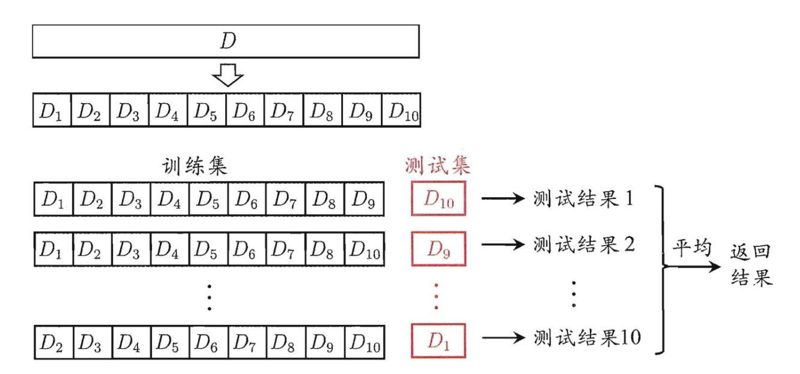

自助法 boostrapping

- 自助采样法:
  - $\lim_{m\rightarrow \infty}(1-\frac{1}{m})^{m}\to\frac{1}{e}\approx0.368$
- 测试集: $D/D’$
- 优点
  - 适用于数据集较小，难以划分;
  - 从数据集产生不同的训练集，适用于集成学习方法;
- 缺点
  - 产生的训练集改变了初始数据集的分布，会引入估计偏差。

性能度量

- 不同任务，性能度量不同

  - 回归任务 - 均方误差:
    - $E(f;D)=\frac{1}{m}\sum_{i=1}^{m}(f(x_{i}-y_{i}))^{2}$
  - 更一般:
    - $E(f;D)=\int_{x\sim D}(f(x_{i}-y_{i}))^{2}p(x)dx$

- 错误率和精度 - 分类任务

  - 错误率
    - $E(f;D)=\frac{1}{m}\sum_{i=1}^{m} \mathbb I (f(x_{i}\neq y_{i}))$, $\mathbb I$ is the indicator function
  - 精度
    - $acc(f;D)=\frac{1}{m}\sum_{i=1}^{m}\mathbb I (f(x_{i}=y_{i}))=1-E(f;D)$
  - 更一般:
    - $E(f;D)=\int_{x\sim D}\mathbb I (f(x)\neq y)p(x)dx$
    - $acc(f;D)=\int_{x\sim D}\mathbb I (f(x)= y)p(x)dx=1-E(f;D)$

- 查准率precision 、 查全率recall与F1

  - 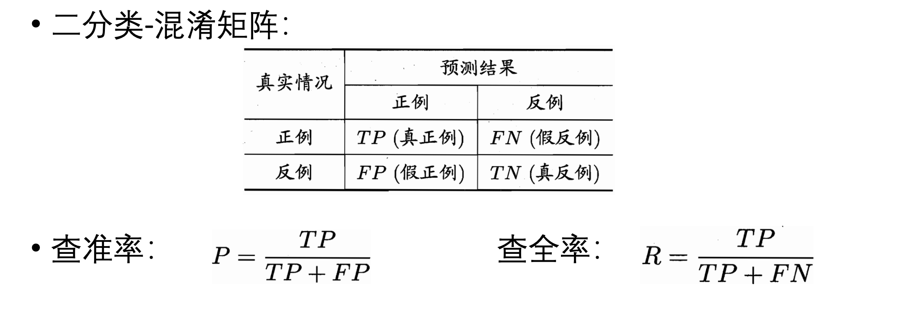

-  P-R曲线

  - 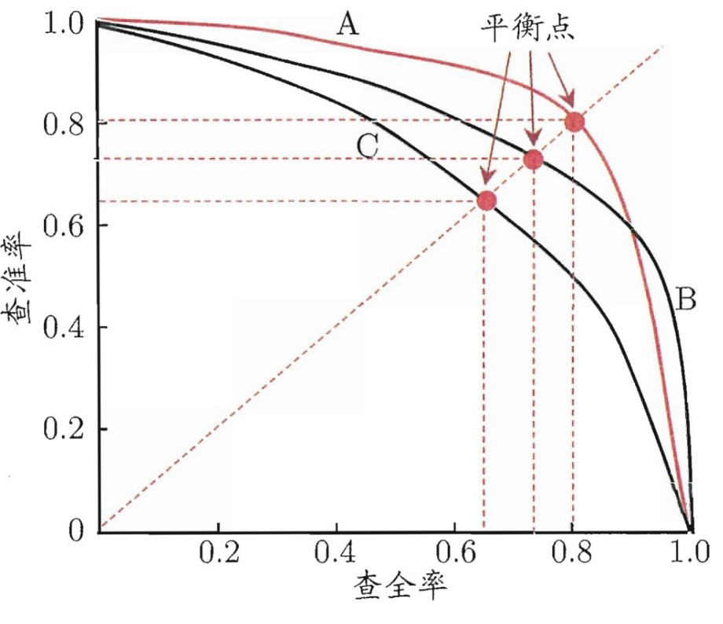
  - 平衡点BEP
    - 查准率$=$查全率
  - $F1$度量
    - $F1=\frac{2\times P\times R}{p+R}=\frac{2\times TP}{样例总数+TP-TN}$
  - $F_{\beta}$ 度量
    - $F_{\beta}=\frac{(1+\beta^{2})\times P\times R}{(\beta^2\times P) + R}$
  - 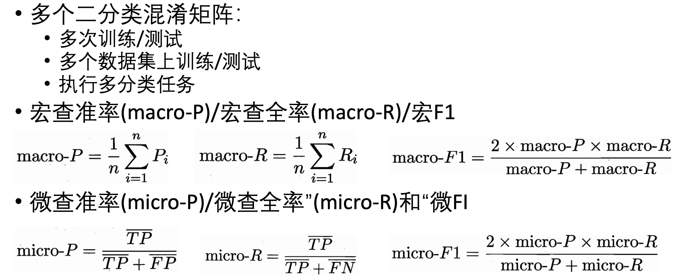

  - ROC (Receiver Operating Characteristic), AUC(Area Under ROC Curve)
    - 纵轴:“真正例率 ” (True Positive Rate, 简称 TPR)
    - 横轴:“假正例率” (False Positive Rate, 简称 FPR)
    - $TPR=\frac{TP}{TP+FN}$, $FPR=\frac{FP}{TN+FP}$
    - 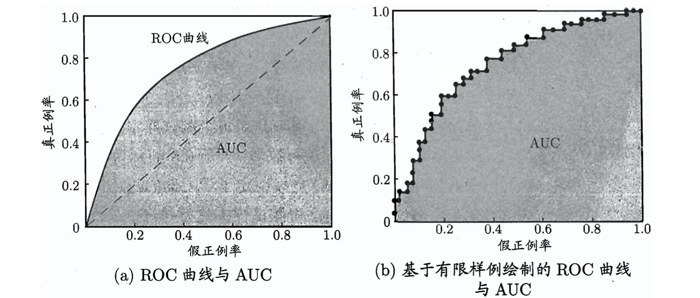
  - 代价敏感错误率与代价曲线
    - 应用背景: 不同类型的错误所造成的后果不同
    - 二分类任务:代价矩阵(cost matrix)
      - 
      - 对应代价敏感错误率
        - $E(f;D;cost)=\frac{1}{m}(\sum_{x_{i}\in D^{+}}\mathbb I(f(x_{i})\neq y_{i})\times cost_{01} + \sum_{x_{i}\in D^{-}} \mathbb I f(x_{i})\neq y_{i}\times cost_{10})$
        - 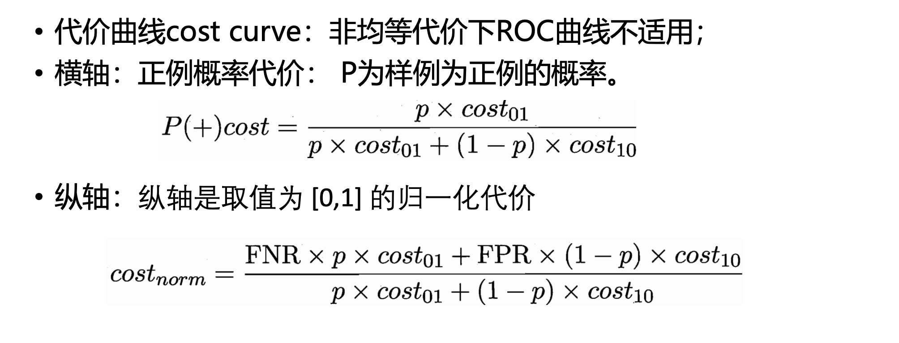
        - 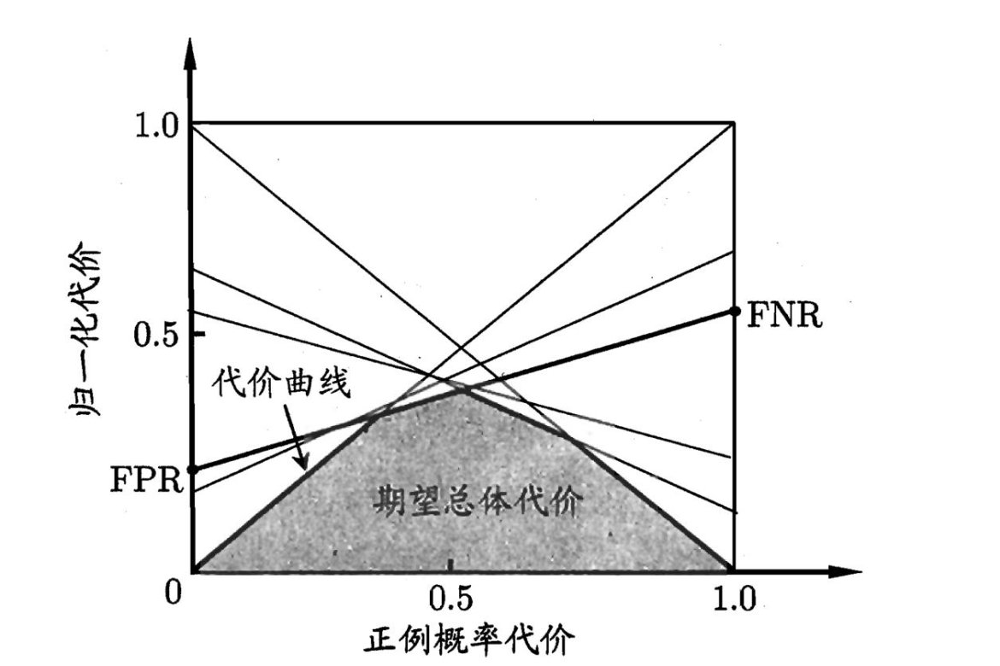

- 比较检验

  - 问题提出: 能否直接用上述评估方法获得的性能度量"比大小"?
    - 答案:不能
  -  原因:
    - 希望比较泛化性能，实验评估的是测试集性能;
    - 测试集性能和测试集的选择有关，测试样例不同，结果不同;
    - 机器学习算法本身有一定的随机性，相同的参数，相同的数据集， 结果也会不同。
  - 方案: 统计假设检验(hypothesis test)
    - 在测试集上观察到学习器A比B好, 则 A 的泛化性能是否在统计意义上优于 B, 以及这个结论的把握有多大

- 假设检验

  - 对单个学习器泛化性能的假设进行检验
  - "二项检验" (binomial test)
    - $t$ 检验 (t-test)
  - 对不同学习器的性能进行比较
    - "成对$t$ 检验" (paired t-tests)

- 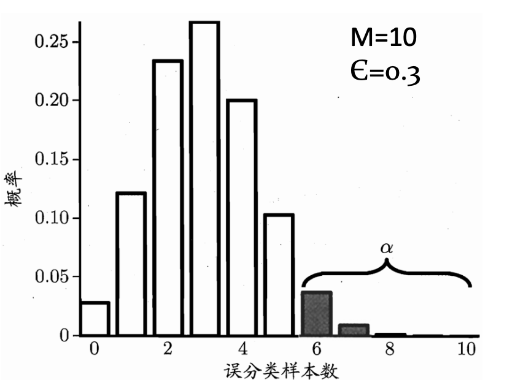

